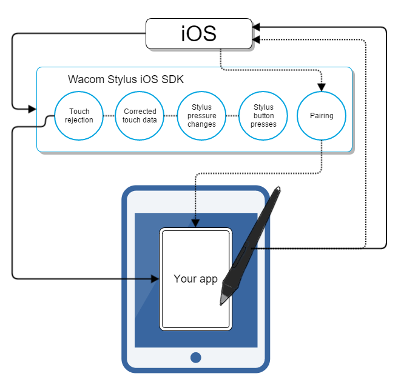

# Bluetooth Stylus SDK - Getting Started

## Download the SDK

Download the SDK from https://developer.wacom.com/developer-dashboard

* Login using your Wacom ID
* Select **Downloads for Wacom Ink Connectivity**
* Download **Bluetooth Stylus SDK for iOS**
* Accept the End User License Agreement to use the SDK

The downloaded Zip file contains the SDK with documentation.

## SDK license

The SDK is free of charge and does not need a license.

## Using the SDK

### How the Wacom Stylus iOS and iPadOS SDK works

### Where to start

Add the following to your app’s Xcode project:
• The WacomDevice.framework
• The WacomStylusFrameworkResources.bundle

You can find them in the sdk folder included in the Wacom Stylus SDK download. All supported languages are included in the bundle.

### Wacom stylus iOS demo app
You can view the code used to create the demo app to see an example of an implementation using the Wacom Stylus iOS and iPadOS SDK.

You can also build the demo app to view an example of what an app using the SDK could look like on an iPad.

1. From the Wacom_Stylus_SDK folder that you downloaded, open the WacomStylusDemoApp folder.
2. Build the demo app.
3. Open the demo app on your iPad.
4. Hold your stylus slightly above the iPad and press the stylus button.
      a. A window opens displaying the name of your stylus. When your stylus has paired to your iPad, you see a checkmark next to the stylus name in that window.
      b. Tap Done.
5. With your stylus, tap Hand Position and select the option that most closely matches how you hold your stylus.
6. Tap if you want to turn touch rejection on. Tap it again to turn it off.
7. Using your stylus, start drawing in the blank space in the demo app to see how using the Wacom Stylus iOS SDK can be applied in your app.
8. Tap Clear to clear the page. Note: Rotating your iPad also clears the page.

----

        

