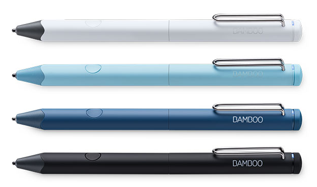

# Wacom Device Kit - Bluetooth Stylus SDK for iOS

> IMPORTANT NOTE
> This series of Wacom products is now discontinued and support for them is no longer offered.

## Introduction

What you can do with the Bluetooth Stylus SDK for iOS:

The Wacom Stylus iOS SDK gives you the tools you need so that your app can interface with Wacom stylus products.
• Pair your app with stylus products and iPads or iPhones by Bluetooth Smart, based on the Core Bluetooth framework.
• Capture pressure data so you can use that information to add drawing or writing to your app.
• Make your app easier to use by applying a function to stylus buttons.
• Improve line quality in your app by letting the SDK handle touch information for you and by accessing coalesced touch information.
• Enhance the accuracy of your app by incorporating touch rejection.

Integrating support for Wacom stylus products in your drawing or handwriting app gives your app users a convenient way to work in your application.

The overview document describes the SDK. The markdown format (readme.md) contains:

* High level overview of architecture of SDK from the developer point of view (Conceptual)
* High level description of key components
* Description of what the sample code does, and how this interacts with the SDK

---

# Additional resources 

## Sample Code
For further samples check Wacom's Developer additional samples, see [https://github.com/Wacom-Developer](https://github.com/Wacom-Developer)

## Documentation
For further details on using the SDK see [Wacom Device Kit - Bluetooth SDK](https://developer-docs.wacom.com/docs/overview/discontinued-sdks/ms-overview/) 

The API Reference is available directly in the downloaded SDK.

## Support
If you experience issues with the technology components, please see the related [FAQs](https://developer-support.wacom.com/hc/en-us)

For further support file a ticket in our **Developer Support Portal** described here: [Request Support](https://developer-support.wacom.com/hc/en-us/requests/new)

## Developer Community 
Join our developer community:

- [LinkedIn - Wacom for Developers](https://www.linkedin.com/company/wacom-for-developers/)
- [Twitter - Wacom for Developers](https://twitter.com/Wacomdevelopers)

## License 
This sample code is licensed under the [MIT License](https://choosealicense.com/licenses/mit/)

---
